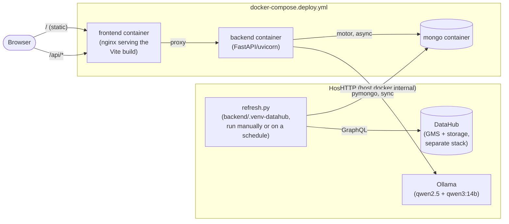

# IDG Data Quality Dashboard

DataHub-metadata-driven data governance dashboard. Current-state metadata
(datasets, schemas, lineage, ownership, incidents, usage, assertions) is
synced from a real DataHub instance; a derived weekly maturity-level history
is computed and stored on top of that in MongoDB. An on-prem LLM (via Ollama)
powers an AI agent panel that answers governance questions against a
whitelisted set of real queries — it never writes its own database query or
sees anything the whitelisted tools didn't return.

## Stack

- **MongoDB** — Docker container; holds synced current-state metadata plus
  the derived maturity-level history
- **Backend** — Python FastAPI (`backend/`), talks to Mongo via `motor`
- **Frontend** — Vite + React + TypeScript + MUI + ECharts (`frontend/`)
- **DataHub integration** — `backend/datahub_ingest.py` (pushes a synthetic
  scenario into a real DataHub instance — swap this step for your own
  ingestion recipes to point at real company metadata instead),
  `backend/datahub_sync.py` (reads DataHub back into Mongo via GraphQL),
  `backend/refresh.py` (sync + maturity-history recompute — the one command
  `deploy.sh` runs on every deploy)
- **AI agent** (`backend/app/agent/`) — on-prem Ollama models only, never an
  external API:
  - `/agent/query`: single-shot intent classification (`ollama_client.classify_intent`)
    against 11 whitelisted intents, dispatched to hardcoded Mongo queries in
    `intents.py`
  - `/agent/chat`: a bounded native-tool-calling loop (up to 4 rounds) so a
    question needing 2+ whitelisted lookups chained together (e.g. "who
    improved most, and who's their data owner") can be answered without
    hardcoding every combination as its own intent, fronted by an in-memory
    exact-match plan cache. A mechanical grounding check
    (`intents._reply_is_grounded`) verifies every number in the phrased
    reply traces back to real queried data before it's shown to the user.
- **Maturity scoring** — config-driven, not hardcoded: the dimensions that
  sum into a subject's maturity score live in
  `backend/config/maturity_dimensions.json` (key, label, weight, scoring
  rule, responsible role). Add a dimension there and restart the backend —
  every chart, badge, and axis adapts automatically. See
  `backend/app/scoring.py`.

## Architecture

Three runtime containers (`docker-compose.deploy.yml`), plus two things that
run on the host rather than in a container: the DataHub sync tooling (needs
its own dependencies, see below) and Ollama (a system service, not
something this project starts).



- **`frontend` container** — nginx serving the static Vite build; also
  reverse-proxies `/api/*` to the backend container (see
  `frontend/nginx.conf`) so the browser only ever talks to one origin.
- **`backend` container** — FastAPI/uvicorn, talks to Mongo via `motor`
  (async) and to Ollama over HTTP. Stateless — it never writes to DataHub or
  runs any sync itself; it only ever reads from Mongo.
- **`mongo` container** — the only place current-state metadata and derived
  history actually live. Nothing here is ephemeral/recomputed-on-read; every
  router just queries pre-computed collections.
- **DataHub** — a separate stack (its own GMS/storage/search containers,
  either the project's own `datahub docker quickstart` or a shared company
  instance), not part of `docker-compose.deploy.yml` at all. The backend
  container never talks to DataHub directly — only the host-run sync tooling
  does.
- **Ollama** — a host-level system service (not a container this project
  manages). The backend container reaches it via `host.docker.internal`
  (see `OLLAMA_BASE_URL`/`LLM_BASE_URL` in the Configuration table below).

### Directory layout

```
backend/
  app/
    main.py                 FastAPI app, router registration, CORS
    db.py                   the one motor client (module-level global)
    scoring.py               config-driven maturity scoring engine
    util.py                  shared serialize()/compute_deltas() helpers
    routers/                one file per resource (domains, subjects,
                             teams, governance, maturity, config, agent)
                             -- thin, read-only, all async
    agent/
      ollama_client.py       Ollama /api/chat wrappers (classify_intent,
                              call_with_tools + TOOL_DEFS)
      llm_client.py           Ollama OpenAI-compatible streaming client
                              (final phrasing pass only)
      intents.py              the 11 whitelisted run_* query functions,
                              the tool-calling loop, the plan cache, the
                              grounding check
  datahub_client.py         thin GraphQL wrapper around DataHub's API
  datahub_ingest.py         host-run: pushes the synthetic demo scenario
                             into DataHub (acryl-datahub SDK)
  datahub_sync.py            host-run: reads DataHub back into Mongo
  refresh.py                 host-run: orchestrates sync + maturity
                             history (synthetic or accumulate mode)
  seed.py                    pure-Faker seeding (local dev / tests only)
                             + shared constants/helpers reused by the
                             DataHub path
  config/
    maturity_dimensions.json   the scoring config scoring.py reads
  tests/                     fast integration suite (default `pytest`)
  tests/eval/                 deepeval golden-set suite (opt-in, `-m eval`)

frontend/
  src/
    App.tsx                  top-level layout, tab switching (no router
                             -- tabs are plain component swaps)
    api/client.ts             typed fetch wrappers, one per backend
                             endpoint, plus the /agent/chat SSE parser
    pages/                    one component per tab (Overview, Trends,
                             KpiBreakdown, Governance)
    components/                charts and shared widgets;
                             components/governance/ holds the Governance
                             Health page's cards
    state/store.ts             zustand store (theme mode, config, drawer
                             selection -- deliberately small, most state
                             is local to each page)
    theme/                    the dataviz-skill-derived palette, ECharts
                             theme helpers, MUI theme
```

## Program flow

### 1. Data ingestion & sync (host-run, not in any container)

```
datahub_ingest.py  →  DataHub (GMS)  →  datahub_sync.py  →  Mongo
     (once, or after                      (refresh.py orchestrates
      a data-loss event)                   both sync + history)
```

- `datahub_ingest.py` pushes a synthetic scenario (6 domains × 7 subjects,
  schemas, lineage, assertions, incidents, usage) into DataHub via the
  `acryl-datahub` SDK's `emit()` calls. Entity URNs are **deterministic**
  (`uuid5`, not `uuid4()`) so re-running upserts the same entities instead
  of duplicating them — this matters because DataHub's own daily
  garbage-collection job permanently purges anything it thinks was removed
  (see Known constraints). This step is what you'd swap out to point at
  real company metadata instead — nothing downstream needs to know or care
  where DataHub's data actually came from.
- `datahub_sync.py` reads current state back out via GraphQL
  (`datahub_client.py`'s thin wrapper) and **wholesale-replaces** most Mongo
  collections (`data_subjects`, `schema_fields`, `lineage_edges`,
  `assertions`, `incidents`) — DataHub only ever has "now," so there's
  nothing to merge. `usage_stats` is the one exception: it's **upserted**
  (keyed by subject + day), because the target DataHub instance has no
  timeseries retention and only ever reports "today's" usage point, so real
  accumulation has to happen on this side, one sync at a time.
- `refresh.py` is the single entrypoint: call `datahub_sync.main()`, then
  either regenerate a fake 52-week maturity history (`synthetic` mode,
  default) or upsert this week's one real point (`accumulate` mode) — see
  "Real history at the company" above for why both exist.

### 2. A page load (browser → data)

```
Browser → GET /                 → frontend container serves the built SPA
Browser → GET /api/domains/...  → frontend (nginx) proxies → backend → Mongo
```

Every page follows the same shape: a React page component's `useEffect`
calls one or more typed functions in `frontend/src/api/client.ts`, each of
which hits one FastAPI router endpoint that does a handful of `motor`
queries against already-synced/already-computed Mongo collections and
returns JSON — **no request-time computation of maturity scores or
history**; that's all precomputed by `refresh.py` ahead of time. Routers are
intentionally thin and stateless; `app/scoring.py` and `app/util.py` hold
the only real logic (config-driven dimension scoring, delta math), shared
across routers so e.g. a domain's WoW delta and a subject's WoW delta are
computed identically.

### 3. The AI agent — two distinct paths

**`POST /api/agent/query`** (single-shot, used by anything that just needs
one deterministic lookup):
```
question → ollama_client.classify_intent()   (structured-output /api/chat,
                                                picks 1 of 11 intent names
                                                + typed params -- never a
                                                free-text query)
         → intents._dispatch_llm_intent()     (maps intent name → one of
                                                the 11 whitelisted run_*
                                                functions)
         → a hardcoded Mongo query             (the only thing that ever
                                                touches the database)
         → {answer_text, chart_directive, data}
```
Falls back to a small keyword classifier (`_classify_and_run_keywords`) if
Ollama is unreachable or returns "unknown."

**`POST /api/agent/chat`** (streamed via SSE, used by the chat panel;
handles multi-part questions the single-shot path can't):
```
question → exact-match plan cache lookup (intents._plan_cache)
    │
    ├─ cache hit  → re-execute the cached tool list live (data is never
    │               cached, only which tools to call)
    │
    └─ cache miss → bounded tool-calling loop (≤ 4 rounds):
                      ollama_client.call_with_tools() → model requests
                      0+ of the 11 whitelisted tools (TOOL_DEFS) → each
                      dispatched via TOOL_HANDLERS to the same run_*
                      functions /agent/query uses → results fed back to
                      the model → repeat until it stops requesting tools
                      or the round cap forces a stop
    │
    ▼
llm_client.stream_chat_completion()  (qwen3:14b, tools NOT offered here --
                                       forced to produce text, not another
                                       call; streams token-by-token as SSE)
    │
    ▼
intents._reply_is_grounded()  (mechanical check: every number in the
                                phrased reply must trace back to the real
                                tool data within a small tolerance)
    │
    ├─ grounded     → stream that reply, cache the tool plan used (only if
    │                 1+ tools were called)
    └─ not grounded → fall back to the deterministic answer_text(s) the
                       tools themselves already produced -- the persisted
                       reply is always correct even if the phrasing model
                       hallucinated
```

The model **never writes a database query** in either path — it only ever
picks from a fixed, typed set of 11 pre-built lookups. See the AI agent
bullet under Stack above and `CLAUDE.md` for more.

### 4. Maturity scoring (how a single number gets computed)

```
raw signals (schema completeness, lineage edges, assertion pass rate,
freshness, ownership, ...)
    → app/scoring.py: compute_dimension_scores(context)   (5 continuous
                                                              0-1 KPI scores,
                                                              config-driven
                                                              from
                                                              maturity_dimensions.json)
    → compute_maturity_level(context)                     (the headline
                                                              L1-L5 ladder
                                                              value)
```
This computation is identical regardless of history mode or where the
current-state inputs came from (real DataHub sync or `seed.py`'s Faker
data) — only what happens to the *result* differs (stored as one of 52 fake
historical points, or upserted as this week's one real point).

## Company / on-prem installation (fresh environment)

A complete runbook for standing this up on a new machine — e.g. a company
server or a colleague's laptop — from nothing. Everything runs entirely
on-prem: no external API calls, no data leaves the machine, no API keys
needed anywhere in this stack.

### Step 0 — install Docker and Ollama (skip anything already installed)

**Docker:**
- macOS: install **Docker Desktop** from <https://www.docker.com/products/docker-desktop/>,
  or `brew install --cask docker`. Launch it once (it runs as a background
  app/menu-bar icon — Docker isn't "on" until that app is running).
- Linux: install **Docker Engine** — <https://docs.docker.com/engine/install/>
  (follow the instructions for your distro). Add your user to the `docker`
  group so you don't need `sudo` for every command:
  `sudo usermod -aG docker $USER` (log out/in afterward).
- Windows: **Docker Desktop** with WSL2 backend — <https://www.docker.com/products/docker-desktop/>.

Give Docker at least **~12 GB of memory** (Docker Desktop → Settings →
Resources). DataHub's own quickstart stack plus this project's containers
is not lightweight — under-provisioning has caused DataHub's GMS service to
get OOM-killed in practice.

Verify:
```bash
docker run hello-world
```

**Ollama:**
- macOS: `brew install ollama`, or download from <https://ollama.com/download>.
- Linux: `curl -fsSL https://ollama.com/install.sh | sh`
- Windows: installer from <https://ollama.com/download>.

Start it (macOS/Windows: launching the app starts the background service;
Linux: `ollama serve`, or it's already running as a systemd service after
install), then pull the two models this project uses:
```bash
ollama pull qwen2.5:latest   # fast, used for intent classification / tool selection
ollama pull qwen3:14b        # used for the final natural-language phrasing pass (~9 GB, slower to pull)
```

Verify both show up:
```bash
ollama list
```

**Also needed on the host** (not containerized — see why below): **Python 3**
(3.10+) and **Node.js** (18+, only needed if you'll build the frontend
outside Docker, which normally you won't — `deploy.sh` builds it in a
container).

### Step 1 — get a DataHub instance running

If the company already has a shared DataHub instance, skip straight to
**Step 3** and just point `DATAHUB_GMS_URL` at it (see below) — you don't
need your own.

Otherwise, run DataHub's own quickstart on this machine:
```bash
pip install acryl-datahub
datahub docker quickstart
```
(This pulls and starts DataHub's full stack — GMS, MySQL, OpenSearch,
Kafka, its own frontend — as a separate set of containers from this
project's own `docker-compose.deploy.yml`. First run takes a while; it's
downloading several images.)

Verify: <http://localhost:9002> (DataHub's own UI) loads, and:
```bash
curl -s http://localhost:8080/health   # DataHub GMS health check
```

### Step 2 — clone this repo and set up the DataHub tooling venv

```bash
git clone <this repo's URL>
cd idg-dashboard

# Dedicated venv for the ingestion/sync tooling only — kept separate from
# the app's own venv because acryl-datahub is a heavy dependency you don't
# want bloating the FastAPI image that actually serves traffic.
python3 -m venv backend/.venv-datahub
backend/.venv-datahub/bin/pip install -r backend/requirements-datahub.txt
```

### Step 3 — populate DataHub with data

Two options:

- **Demo scenario (synthetic, for trying the dashboard out):**
  ```bash
  cd backend && ../backend/.venv-datahub/bin/python3 datahub_ingest.py && cd ..
  ```
  One-time only (safe to re-run — it upserts the same deterministic
  entities rather than duplicating them). Prints progress per domain and
  ends with `Done. 42 subjects ingested.`
- **Real company metadata:** point this at your company's actual DataHub
  instance instead (see `DATAHUB_GMS_URL` below) and skip `datahub_ingest.py`
  entirely — `datahub_sync.py` just reads whatever domains/datasets/lineage
  already exist there. (You'd still need domains matching this project's
  expected set, or adapt `backend/app/routers/` — this dashboard's scoring
  model assumes a fixed small set of domains, not arbitrary DataHub content.)

Verify DataHub actually has data before moving on:
```bash
curl -s -X POST http://localhost:8080/api/graphql -H "Content-Type: application/json" \
  -d '{"query":"{ search(input: {type: DATASET, query: \"*\", start: 0, count: 0}) { total } }"}'
```
Should report a non-zero `total`.

### Step 4 — deploy

```bash
./deploy.sh
```

This brings up Mongo, syncs current-state metadata from DataHub into it
(via `backend/.venv-datahub` + `refresh.py`), then builds and starts the
backend and frontend containers. Watch for `Deployed. Waiting for
containers to report healthy...` followed by a clean `docker compose ps`
listing all three containers as `Up`.

Open **http://localhost:8081**.

### Re-deploying later (after `git pull` or any code change)

```bash
./deploy.sh
```

Idempotent — safe to re-run any time. Rebuilds the backend/frontend images
and re-syncs from DataHub every time.

### Configuration (only if defaults don't fit)

Override with env vars before running `./deploy.sh`, e.g.
`FRONTEND_PORT=9090 ./deploy.sh`:

| Env var | Default | When to change it |
|---|---|---|
| `FRONTEND_PORT` | `8081` | Port already in use, or multiple deployments on one host |
| `DEPLOY_MONGO_PORT` | `27018` | Port already in use |
| `DATAHUB_GMS_URL` | `http://localhost:8080` | DataHub runs on a different host/port |
| `OLLAMA_BASE_URL` | `http://host.docker.internal:11434` | Ollama runs on a different host, or you're not on Docker Desktop (Linux's Docker Engine may need the host's real LAN IP instead of `host.docker.internal`) |
| `LLM_BASE_URL` | `http://host.docker.internal:11434/v1` | Same as above (this is Ollama's OpenAI-compatible endpoint, same server, `/v1` suffix) |
| `OLLAMA_MODEL` | `qwen2.5:latest` | Using a different tool-calling-capable local model |
| `LLM_MODEL` | `qwen3:14b` | Using a different local model for phrasing |
| `MATURITY_HISTORY_MODE` | `synthetic` | Pointing at a real company DataHub instead of the demo scenario — see "Real history at the company" below |

### Real history at the company

The demo scenario's Trends page shows a full year of history the moment you
deploy — but that's only possible because it's fabricated: `refresh.py`
defaults to **`synthetic` mode**, which deletes and regenerates a fake
52-week backward random-walk ending at today's real score, every single
run. That's fine for a self-contained demo, but a real company DataHub has
no timeseries retention of its own — it can only ever say "here's the state
right now" — so if you pointed the demo default at real company metadata,
every trend line and WoW/MoM/YoY delta would still be fabricated, and would
even fabricate a *different* fake past on every re-run.

**`MATURITY_HISTORY_MODE=accumulate`** switches to the mode you actually
want for real data: each run upserts exactly **one** real, dated snapshot
(today's real score) per subject/domain/global, and never touches any
previously-accumulated week — the same principle already used for
`usage_stats`. Real history then only ever grows forward from whenever this
starts running on a schedule; there's no way to retroactively invent real
history DataHub itself never had, so the Trends page will look sparse (a
single point, then two, then three...) until it's been running for a while.

This needs a **recurring schedule**, separate from `./deploy.sh` (which also
rebuilds/restarts the backend and frontend containers — unnecessary and
disruptive to run just to sync data). Point a cron job / systemd timer /
Task Scheduler entry directly at `refresh.py`:

```bash
# e.g. a daily cron entry:
0 6 * * * cd /path/to/idg-dashboard/backend && \
  MONGO_URL="mongodb://localhost:27018" MONGO_DB="idg_dashboard" MATURITY_HISTORY_MODE=accumulate \
  .venv-datahub/bin/python3 refresh.py >> /var/log/idg-refresh.log 2>&1
```

`./deploy.sh` itself doesn't need to change — it doesn't clear the
environment, so `MATURITY_HISTORY_MODE=accumulate ./deploy.sh` also works
for a manual one-off run in this mode.

### Useful commands

- Logs: `docker compose -p idg-deploy -f docker-compose.deploy.yml logs -f`
- Stop: `docker compose -p idg-deploy -f docker-compose.deploy.yml down`
- Status: `docker compose -p idg-deploy -f docker-compose.deploy.yml ps`

### Troubleshooting

- **Dashboard loads but shows 0 domains / 0 data subjects, everything
  else looks healthy** — DataHub itself has no data (or lost it — see
  "Known constraints" below for why that can happen). Confirm with the
  GraphQL check in Step 3; if `total` is 0, re-run Step 3.
- **DataHub GMS keeps crashing / restarting** — almost always Docker's
  memory allocation (see Step 0). Bump it up and `datahub docker quickstart`
  again, or restart the `datahub-gms` container.
- **Agent chat times out or falls back to the keyword-only reply** —
  Ollama isn't reachable from inside the backend container. Confirm
  `ollama list` works on the host, confirm the backend container can reach
  it: `docker exec idg-deploy-backend-1 curl -s http://host.docker.internal:11434/api/tags`.
  On Linux, `host.docker.internal` may need `OLLAMA_BASE_URL` overridden to
  the host's actual IP instead (see Configuration above).
- **Port already in use** — another process (often a previous, un-stopped
  deploy) is holding `8081`/`27018`. `docker ps` to find it, or override
  the port env vars above.

## Local dev (hot reload)

```bash
# 1. Mongo only
docker compose up -d

# 2. Backend
cd backend
python3 -m venv .venv && source .venv/bin/activate
pip install -r requirements.txt
# Populate Mongo with fake demo data directly (no DataHub needed for this path):
python seed.py                 # safe to re-run, drops & recreates
# ...or sync from a real DataHub instance instead, see "Company / on-prem
# installation" above (backend/.venv-datahub + refresh.py).
uvicorn app.main:app --reload --port 8010

# 3. Frontend (new terminal)
cd frontend
npm install
npm run dev                    # http://localhost:5173, proxies /api -> :8010
```

Open **http://localhost:5173**.

## Testing

```bash
# Fast integration suite (real HTTP against the FastAPI app, real Mongo,
# separate idg_dashboard_test database — never touches your demo data).
# Also exercises the real Ollama models where reachable, skips gracefully
# where not. Runs in a few minutes.
cd backend
python3 -m venv .venv && .venv/bin/pip install -r requirements.txt -r requirements-test.txt
.venv/bin/pytest

# LLM-judged golden-set eval suite (deepeval), separate and opt-in — needs
# its own venv (deepeval pulls a newer pydantic than the pinned app version)
# and takes ~5-8 min per question (real agent call + local LLM-as-judge
# grading), so it's excluded from the default `pytest` run.
python3 -m venv backend/.venv-eval
backend/.venv-eval/bin/pip install -r backend/requirements-eval.txt -r backend/requirements-test.txt \
  fastapi "uvicorn[standard]" motor Faker python-dotenv httpx
backend/.venv-eval/bin/pytest -m eval -v
```

## What's there

- **總覽 (Overview)** — headline Data Quality Index (WoW delta + 8-week
  sparkline), maturity distribution (clickable to filter), domain ranking
  (clickable to filter), Leaderboard (badge tiers for domains/owner-teams/
  subjects in stable non-ranked order, weekly/monthly champion cards,
  positive-only "most improved" spotlights), data subject table
- **週 / 月 / 年變化 (Trends)** — WoW/MoM/YoY sortable table by domain or
  subject, with sparklines and a Level-distribution chart (stacked
  composition + per-level trend lines); click a row to drill into detail
- **KPI 拆解** — heatmap of every dimension × every domain/subject, plus
  org-wide per-dimension averages, so you can compare one KPI (e.g.
  Alerting) across the whole org at once
- **治理健康 (Governance Health)** — risk-priority ranking (usage × gap-
  from-max), ownership coverage, stewardship/incident response, lineage
  coverage (with "orphan" datasets that have no lineage at all), and a
  data-subject growth-anomaly check (flags domains where new datasets are
  showing up unusually fast — often a mis-tagging signal)
- **Ownership model** — each subject has a Data Owner / Data Steward / IT
  Owner (name + team). Individual names only ever appear in that one
  subject's detail drawer; the public Leaderboard aggregates by the Data
  Owner's team, never by individual, to avoid publicly naming anyone's
  under-performing data. Each of the 5 KPI dimensions is tagged with which
  role is responsible for it.
- **AI agent panel** (bottom-right FAB) — ask e.g. "目前 data maturity 最高
  的三個 Domain?" or a multi-part question like "本週進步最多的 Domain,以及
  目前 Ownership 覆蓋率多少?"; the answer also highlights the relevant chart.
  See the AI agent bullet under Stack above for how it stays grounded.
- Light/dark mode toggle (top-right), following the `dataviz` skill's
  validated palette in both modes
- **報表 (Reports)** — a second, AG Charts/AG Grid-based dashboard surface
  built from two Figma references, toggled between two views: **Global
  Reports** (domain donut, governance KPI grid, dimension-breakdown combo
  chart) and **Monthly Trend** (sparkline stat cards, 3 ranked Top3
  panels, a dual-axis subject-count/maturity-level combo chart). See
  "Reports page — wiring guide" below for how each piece connects to the
  backend.

## Reports page — wiring guide (AG Charts / AG Grid)

The 報表 (Reports) tab is a second dashboard surface built with
[AG Charts](https://www.ag-grid.com/charts/) and
[AG Grid](https://www.ag-grid.com/) instead of ECharts/MUI X Data Grid,
modeled on two separate Figma references — a "Global Reports" view and a
"Monthly Trend" view, toggled with the `GLOBAL REPORTS` / `MONTHLY TREND`
buttons at the top of the tab. This section exists so you can lift these
components into a connection against a different (company) backend without
re-reading the source from scratch — for each piece: what it renders, what
data shape it needs, and exactly what to change to repoint it.

### Files

```
frontend/src/pages/ReportsPage.tsx                       -- container: breadcrumb, view toggle, 3 KPI tiles, domain filter
frontend/src/components/reports/ProductSuiteDonutChart.tsx   -- AG Charts donut (Global Reports view)
frontend/src/components/reports/GovernanceKpiGrid.tsx        -- AG Grid table + 4 stats + 2 chips (Global Reports view)
frontend/src/components/reports/DimensionBreakdownChart.tsx  -- AG Charts stacked-bar + line combo (Global Reports view)
frontend/src/components/reports/MonthlyTrendView.tsx         -- container for the Monthly Trend view's own layout
frontend/src/components/reports/SparklineChart.tsx           -- AG Charts micro line chart (Monthly Trend view's 2 stat cards)
frontend/src/components/reports/MomentumTop3Panel.tsx         -- plain MUI ranked list (Monthly Trend view's 3 Top3 panels)
frontend/src/components/reports/MonthlyTrendChart.tsx         -- AG Charts dual-axis combo (Monthly Trend view's main chart)
```

Plus two small edits to existing files that any copy of this page needs:
`frontend/src/main.tsx` (module registration, see "Setup gotchas" below)
and `frontend/src/App.tsx` (adds the `reports` tab). The Monthly Trend view
additionally needed one small **backend** change — see its own section
below.

### Data-flow convention

Same pattern as every other page in this app (Overview/Trends/Governance):
**no shared cache, no Redux** — each component owns a `useState` and fetches
its own data independently in a `useEffect` on mount (see e.g.
`RiskPriorityChart.tsx` for the pre-existing example this follows). Two of
the four Reports components additionally take a `domainFilter: string | null`
prop from `ReportsPage.tsx` and re-fetch (`GovernanceKpiGrid.tsx`) or
re-filter client-side (`ProductSuiteDonutChart.tsx`,
`DimensionBreakdownChart.tsx`) when it changes.

### Component-by-component (Global Reports view)

**1. `ReportsPage.tsx` — the 3 KPI tiles + breadcrumb + domain filter**

- Fetches: `api.maturitySummary()` → `{ latest: OrgSnapshot }`,
  `api.domainRanking()` → `{ domains: OrgSnapshot[] }`.
- The 3 tiles (Domain count / Data Subject count / Maturity Level) are
  computed client-side from those two responses, switching between the
  global snapshot and the filtered domain's row depending on
  `domainFilter`.
- Owns the `domainFilter` state (a plain `useState<string>`, driven by a
  MUI `TextField select` populated from `palette.ts`'s `DOMAIN_ORDER`) and
  passes it down to the three child components below.
- **To repoint**: swap the two `api.*()` calls for your own fetches. Any
  response works as long as it (or your reshape of it) has `domain`,
  `subject_count`, and `avg_maturity_level` fields — those are the only
  fields this file reads.

**2. `ProductSuiteDonutChart.tsx` — AG Charts donut ("Data Subject Count by
Domain")**

- Fetches `api.domainRanking()` again (independently — this is deliberate,
  see "Data-flow convention" above, not a bug).
- Needs an array of `{ domain: string, subject_count: number }`.
- AG Charts wiring:
  ```tsx
  <AgCharts options={options} style={{ height: '100%', width: '100%' }} />
  ```
  where `options.data = rows.map(d => ({ domain: d.domain, count: d.subject_count }))`
  and `options.series = [{ type: 'donut', angleKey: 'count',
  calloutLabelKey: 'domain', itemStyler: (p) => ({ fill: domainColor(p.datum.domain, mode) }) }]`.
  `options` is typed `AgPolarChartOptions` (see "Setup gotchas" for why the
  type annotation matters).
- Colors come from `domainColor()` in `theme/palette.ts`, which looks the
  domain name up in the hardcoded `DOMAIN_ORDER` array — **the same
  gotcha documented elsewhere in this README**: if your company's domain
  names differ, update `DOMAIN_ORDER` to match exactly (case-sensitive) or
  that domain's slice silently renders in the palette's last fallback
  color instead of erroring.
- **To repoint**: swap the `api.domainRanking()` call; keep the
  `{ domain, subject_count }` shape (or adjust the one-line `.map()` in
  the `rows` computation if your field names differ).

**3. `GovernanceKpiGrid.tsx` — AG Grid table + 4 stat numbers + 2 chips**

- Fetches 5 endpoints: `api.governanceOwnershipCoverage()`,
  `api.governanceLineageCoverage()`, `api.governanceStewardship()`,
  `api.maturitySummary()` (for the 4 stat numbers), and
  `api.subjects({ domain: domainFilter })` (for the grid's rows).
- The 4 stat numbers are plain computed values (coverage/DQI percentages,
  plus a client-computed "on-time %" = `1 - overdue/open` across
  `stewardship.teams`). The 2 chips (`Val. >4` / `Val. <2`) are also
  client-computed: percentage of the currently-fetched `subjects` whose
  `maturity_level` is above/below those thresholds.
- AG Grid wiring:
  ```tsx
  <AgGridReact theme={theme} rowData={subjects} columnDefs={columnDefs} getRowId={(p) => p.data.id} />
  ```
  `theme` is built with the **new Theming API** (AG Grid v33+):
  `themeQuartz.withParams({ backgroundColor, foregroundColor, ... })`, then
  `.withPart(colorSchemeDark)` when `mode === 'dark'`. This is a different
  API from the older CSS-class themes (`ag-theme-quartz` classNames) — if
  you're pinned to an older ag-grid-community major version, this call
  won't exist and you'd use the CSS-class approach instead.
- `columnDefs` are **generated dynamically**: 3 fixed columns
  (name/domain/maturity_level) + one column per entry in
  `useStore(s => s.dimensions)` — which is itself populated once at app
  startup (`App.tsx`'s `useEffect` calling `api.configDimensions()`) from
  the backend's `/config/dimensions` endpoint
  (`backend/config/maturity_dimensions.json`). This means the readiness-dot
  columns automatically match however many scoring dimensions your
  company's config defines — nothing to hand-edit here even if you add or
  rename a dimension.
- Each dot's `cellRenderer` reads `subject.sub_scores[dim.key]` and renders
  green if `score >= READY_THRESHOLD` (a hardcoded `0.7` constant at the
  top of the file — this is an arbitrary "ready" cutoff I picked to match
  the Figma reference's look, not a real business rule; change it to
  whatever your company means by "ready").
- **To repoint**: swap the 5 `api.*()` calls. Keep the `Subject` shape's
  `maturity_level: number | null` and `sub_scores: Record<string, number>`
  fields (or adjust `columnDefs`'/`ReadyDot`'s field access if your
  schema differs), and keep the 4 governance responses' `coverage_pct` /
  `data_quality_index` / `teams[].{open_count,overdue_count}` fields.

**4. `DimensionBreakdownChart.tsx` — AG Charts stacked-bar + line combo**
("Maturity Level by Domain")

- Fetches `api.domainsDimensionBreakdown()` →
  `{ domain, api, metadata, lineage, alerting, freshness }` per domain, and
  `api.domainRanking()` again (for each domain's `avg_maturity_level`, used
  as the overlay line's values).
- Also reads `useStore(s => s.dimensions)` (same source as the grid above)
  to build one `bar` series per dimension key, plus one `line` series for
  `maturity`.
- AG Charts wiring/gotchas worth knowing before you touch this file:
  - `options.axes` is a **dictionary** `{ x: {...}, y: {...} }` in
    ag-charts-community v14 (this app's pinned version), **not an array**
    like some older AG Charts versions or other charting libraries use —
    `tsc -b` will reject an array here with a confusing
    "index signature ... is missing" error.
  - `AgChartOptions` (the generic union type) doesn't narrow correctly for
    TypeScript when you build a cartesian chart's `series`/`axes` inline —
    type the options object explicitly as `AgCartesianChartOptions` (or
    `AgPolarChartOptions` for the donut above); otherwise `tsc -b` picks
    the wrong branch of the union and rejects valid cartesian/polar-only
    options. **This is the one lesson from building this page most worth
    remembering** — `npx tsc --noEmit` will not necessarily catch it the
    same way; always do a final check with `tsc -b` (the real build
    command) per this repo's existing testing convention.
  - All 5 dimension `bar` series share the same `stackGroup: 'dims'`
    string — that's what makes them stack instead of grouping
    side-by-side.
- **To repoint**: swap the 2 `api.*()` calls; keep each domain row's
  dimension-key fields (matching whatever `useStore(s => s.dimensions)`
  resolves to) and an `avg_maturity_level` (or equivalent) field for the
  line.

### The Monthly Trend view (second Figma reference)

Toggling to `MONTHLY TREND` swaps `ReportsPage.tsx`'s body for
`MonthlyTrendView.tsx`, which lays out 2 stat cards, 3 ranked "Top3"
panels, and one big combo chart. Unlike the Global Reports view, this
view's own `MonthlyTrendChart.tsx` owns **its own** domain filter
(a `useState` local to that one component) rather than sharing the
page-level filter — this matches the Figma reference, where the
"Product Suite" dropdown lives *inside* the chart's own card and doesn't
affect the stat cards or Top3 panels above it. `ReportsPage.tsx` hides its
own page-level domain `TextField` while this view is active, to avoid two
confusing, unlinked filters on screen at once.

**1. `SparklineChart.tsx` — the 2 stat cards' micro line charts**

- Pure presentational: takes a `values: number[]` prop and renders a thin,
  axis-less, legend-less, tooltip-less AG Charts line — no independent data
  fetching of its own. `MonthlyTrendView.tsx` feeds it
  `summary.trend.map(s => s.subject_count)` / `...avg_maturity_level` from
  its own `api.maturitySummary()` call.
- **To repoint**: nothing to change here — it's shape-agnostic, just an
  array of numbers.

**2. `MomentumTop3Panel.tsx` — the 3 ranked "Top3" list panels**

- Also pure presentational (a `title` + `rows: Top3Row[]` prop), **not**
  an AG Grid/AG Charts element — this is a plain MUI ranked list, the same
  design call as the Global Reports view's KPI tiles/breadcrumb (see that
  section above): three short rows with a rank badge is layout and text,
  not a grid or a chart, so pulling in AG Grid for it would be a pointless
  abstraction.
- `MonthlyTrendView.tsx` computes all three panels' `rows` from data it
  already fetches for the stat cards: `api.domainRanking()` (for the
  share-of-total "Current Monthly Top3" panel — sorted by `subject_count`,
  primary number = `subject_count / total * 100`, delta = `wow_delta`) and
  `api.domainsTrendSummary('year')` (for the two "Yearly Momentum" panels
  — sorted by `yoy_delta` ascending/descending, primary number =
  `avg_maturity_level`, delta = `yoy_delta`).
- **To repoint**: swap the two `api.*()` calls in `MonthlyTrendView.tsx`;
  keep `domain`, `subject_count`, `avg_maturity_level`, `wow_delta`, and
  `yoy_delta` fields (or adjust the three `.map()` calls that build each
  panel's `rows`).

**3. `MonthlyTrendChart.tsx` — the dual-axis combo chart (bar + per-domain
lines + dashed maturity line)**

- Fetches `api.domainsTrendSummary('year')` (per-domain subject-count
  history) and `api.maturitySummary()` (org-wide subject-count + maturity
  history for the bar and the dashed line), independently of
  `MonthlyTrendView.tsx`'s own fetches of the same two endpoints — same
  "no shared cache" convention as the rest of the app.
- **This chart needed a small additive backend change.**
  `/domains/trend-summary` (`backend/app/routers/domains.py`) previously
  only returned each domain's `avg_maturity_level` history (`series`) —
  nothing about subject-count history, which this chart's per-domain lines
  need. Added two fields to that endpoint's response, both purely
  additive (existing callers/tests are unaffected): `subject_count_series`
  per domain (mirrors the existing `series` field, same window/slicing
  logic) and a top-level `dates` array (one domain's snapshot dates
  represent all of them, since every domain shares the same weekly
  snapshot cadence). If you're repointing this chart at a different
  backend, your equivalent endpoint needs to expose subject-count history
  the same way, not just maturity-level history.
- **Monthly bucketing is done client-side.** This app's underlying history
  is weekly (`org_quality_index_snapshots`, one doc per domain per week —
  see "Data model" above), but the Figma reference reads as a monthly
  trend. `bucketByMonth()` in this file keeps only the *last* snapshot in
  each calendar month, no backend rollup endpoint needed. If your backend
  already has true monthly granularity, you can fetch it directly and
  drop this bucketing step.
- **Dual-axis wiring** — the trickiest AG Charts detail on this page: in
  ag-charts-community v14 (this app's pinned version), a series binds to
  a non-default axis via `yKeyAxis: 'y2'` (a string matching the `axes`
  dictionary's key), **not** via a `keys: [...]` array on the axis itself
  (the property name used by older/classic AG Charts docs you may find
  online — it doesn't exist in this version's types and silently doesn't
  compile the way you'd expect). The dashed maturity-level line is the
  only series with `yKeyAxis: 'y2'` here; every bar/domain-line series
  implicitly uses the default `'y'` axis.
- Two series (`total` and `maturity`) are given `showInLegend: false` so
  they don't appear in AG Charts' own auto-generated bottom legend
  (which is left showing only the per-domain lines, matching the Figma
  reference) — they're shown instead as two manually-built swatch chips
  in the header row above the chart, next to the "Product Suite"/"Data
  Range" filter controls.
- **To repoint**: swap the two `api.*()` calls; keep each domain's
  `subject_count_series` + a shared `dates` array (or equivalent), and
  the org-wide `subject_count`/`avg_maturity_level` history for the bar
  and dashed line.

### Setup gotchas (easy to lose if you copy just one component elsewhere)

- **Module registration is mandatory and easy to forget.** Both AG Grid and
  AG Charts throw `"No modules have been registered"` and crash the whole
  React tree (not just that one chart) if you use them before calling:
  ```ts
  import { ModuleRegistry as GridReg, AllCommunityModule as GridAll } from 'ag-grid-community'
  import { ModuleRegistry as ChartReg, AllCommunityModule as ChartAll } from 'ag-charts-community'
  GridReg.registerModules([GridAll])
  ChartReg.registerModules([ChartAll])
  ```
  This app does it once, at module scope, in `frontend/src/main.tsx` (before
  `createRoot(...).render(...)`) — not per-component, so a fresh app needs
  this once, not once per file.
- **Four packages, not two**: `ag-grid-community` + `ag-grid-react`, and
  separately `ag-charts-community` + `ag-charts-react` — the `-react`
  packages are thin wrapper components (`<AgGridReact>`, `<AgCharts>`); the
  `-community` packages hold the actual engine + module registry + types.

### Repointing at your company's backend — three options

- **Path A — keep the same response shapes.** Point `frontend/src/api/client.ts`'s
  fetch base (the `/api` prefix, proxied by `vite.config.ts` in dev and by
  `frontend/nginx.conf` in the deployed container) at your company's
  backend instead of this repo's FastAPI app. Zero component changes, as
  long as your endpoints return the same JSON shapes as
  `backend/app/routers/{domains,subjects,governance,maturity,config}.py`.
- **Path B — different shapes, same interface.** Keep every function name
  in `api.client.ts`'s `export const api = { ... }` object as the
  boundary; change what's *inside* each one to call your real endpoint and
  reshape the response into the existing TypeScript types
  (`OrgSnapshot`, `Subject`, `DomainDimensionBreakdown`, etc., all defined
  at the top of `client.ts`). None of the 8 Reports files need to change.
- **Path C — lifting just these files into a different React app.** The 8
  files' only dependencies outside themselves are: `api/client.ts`'s type
  imports (swap for your own types), `theme/palette.ts`'s `chrome` /
  `domainColor` / `categorical` (swap for your own color tokens —
  see the `dataviz` skill if you want the same validated-palette approach),
  `state/store.ts`'s `mode` and `dimensions` (swap for however your app
  tracks dark-mode + KPI-dimension config), and `i18n/useT.ts` (drop this
  and replace every `t('key')` call with a plain string if you don't need
  the EN/中 toggle).

## Known constraints

- No auth.
- The demo scenario is synthetic (Faker-generated names/domains) pushed into
  DataHub by `datahub_ingest.py` — swap that ingestion step for your own
  recipes to point at real company metadata; nothing else in the pipeline
  needs to change (`datahub_sync.py` just reads whatever's in DataHub).
- **DataHub's built-in daily garbage-collection job** (`datahub-gc`, default
  schedule `0 1 * * *`) purges soft-deleted entities after a 10-day
  retention window. If the ingestion pipeline is ever re-run in a way that
  produces different entity URNs across runs, DataHub will treat the old
  ones as removed, and they'll be permanently purged once that window
  passes — the symptom is the dashboard showing 0 domains/subjects even
  though every container is healthy. Fix: re-run
  `backend/.venv-datahub/bin/python3 datahub_ingest.py` then `./deploy.sh`
  (or `refresh.py` directly) to repopulate.
- `usage_stats` accumulates across repeated `refresh.py` runs (upsert, keyed
  by subject + day) rather than being replaced wholesale like the other
  synced collections — this is intentional, since the target DataHub
  instance has no timeseries retention and only ever reports "today."
- Maturity-level history works the same way, but it's opt-in: by default
  (`MATURITY_HISTORY_MODE=synthetic`) every `refresh.py` run **fabricates** a
  fresh fake 52-week history ending at today's real score — fine for the
  self-contained demo scenario, but not real history. See "Real history at
  the company" above for the `accumulate` mode that actually preserves real
  weeks going forward, and why it needs a recurring schedule rather than a
  one-off `./deploy.sh`.
- **If you rename the domains** (`seed.py`'s `DOMAINS` list, or whatever
  domains your real DataHub metadata uses), you must also update
  **`frontend/src/theme/palette.ts`'s `DOMAIN_ORDER`** — it's a separate,
  hardcoded list (`['Finance', 'Sales', 'Platform', 'Marketing', 'Product',
  'Risk']` by default) that exists purely so a domain keeps the same chart
  color everywhere (the `dataviz` skill's "fixed order, never cycled" rule).
  It is **not** derived from `seed.py`/DataHub automatically. Three places
  build their data by intersecting real domains against this fixed list
  (`RiskPriorityChart.tsx`, the Trends page's domain filter dropdown,
  `LeaderboardSection.tsx`'s domain ranking) — if none of your renamed
  domains match any entry in `DOMAIN_ORDER`, the intersection comes back
  empty and those three UI pieces silently render with **zero data**, even
  though every other page (which reads domains straight from the API, not
  through this list) looks completely normal. Fix: edit `DOMAIN_ORDER` to
  the exact domain name strings actually stored in `data_subjects.domain`
  (case-sensitive), in whatever order you want their chart colors assigned,
  then rebuild the frontend (`./deploy.sh`).
